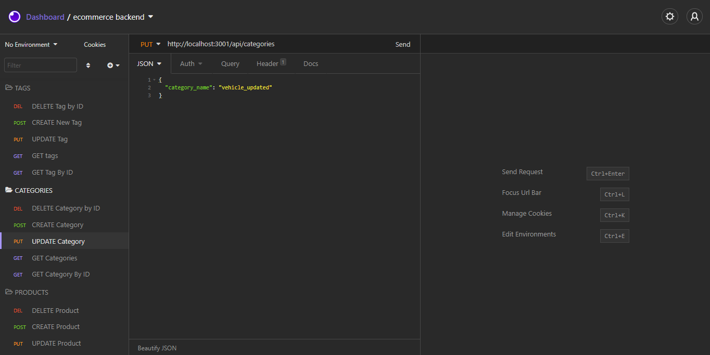
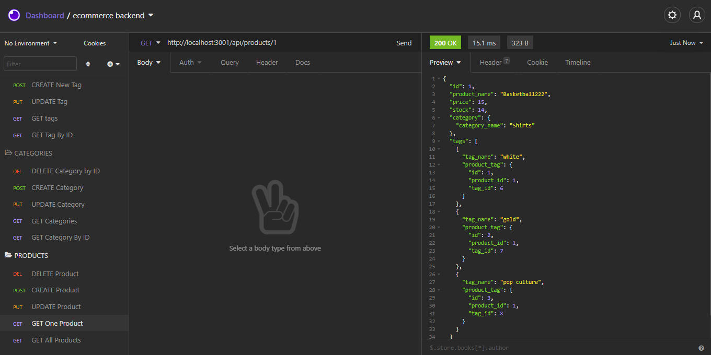

# 13 E-Commerce Back End

This is the README for the back end built for an e-commerce site by modifying starter code. This works with Express.js API to use Sequelize to interact with a MySQL database.

This application has not been deployed, so you will find a link to a walk-through video that demonstrates its functionality and all of the acceptance criteria being met. The link of the walk-through video can be found at the bottom of the README file.

## User Story

```md
AS A manager at an internet retail company
You WANT a back end for your e-commerce website that uses the latest technologies
SO THAT your company can compete with other e-commerce companies
```

## Acceptance Criteria

```md
GIVEN a functional Express.js API
WHEN you add your database name, MySQL username, and MySQL password to an environment variable file
THEN you are able to connect to a database using Sequelize
WHEN you enter schema and seed commands
THEN a development database is created and is seeded with test data
WHEN you enter the command to invoke the application
THEN your server is started and the Sequelize models are synced to the MySQL database
WHEN you open API GET routes in Insomnia Core for categories, products, or tags
THEN the data for each of these routes is displayed in a formatted JSON
WHEN you test API POST, PUT, and DELETE routes in Insomnia Core
THEN you are able to successfully create, update, and delete data in my database
```

## Mock-Up

The following animation shows the application's GET routes to return all categories, all products, and all tags being tested in Insomnia Core:


The following animation shows the application's POST, PUT, and DELETE routes for categories being tested in Insomnia Core:



The following animation shows the application's GET routes to return a single category, a single product, and a single tag being tested in Insomnia Core:



The walk-through video also shows POST, PUT, and DELETE routes for products and tags being tested in Insomnia Core.

## Getting Started

- open the command line
- type "npm install" (to install the dependencies)
- add the .env file linked to your MySQL with your password details
- open up MySQL command
- run the command under schema.sql on MySQL command line (Use the `schema.sql` file in the `db` folder to create your database with MySQL shell commands. Use environment variables to store sensitive data like your MySQL username, password, and database name)
- type "npm run seed" (to seed the database)
- type "npm start" (to run the app and Sync Sequelize to the Database on Server Start)

### RESTful CRUD Operations have been setup as follows

TAGS

- DELETE Tag By ID
- CREATE New Tag
- UPDATE Tag
- GET Tags
- GET Tag By ID

CATEGORIES

- DELETE Category By ID
- CREATE New Category
- UPDATE Category
- GET Categories
- GET Category By ID

PRODUCTS

- DELETE Product By ID
- CREATE New Product
- UPDATE Product
- GET Products
- GET Product By ID

## Links

- A walkthrough video demonstrating the functionality of the application and all of the acceptance criteria being met: <https://drive.google.com/drive/folders/1-yWDyYswmLmhSoFgT5psNPo5bvmV-XTG?usp=sharing>
- The URL of the GitHub repository. Give the repository a unique name and include a readme describing the project: <https://github.com/mskippen/13-02-Object-Relational-Mapping.git>

## Contact

## Megan Skippen <https://github.com/mskippen>

© 2021 Project Agents Pty Ltd. All Rights Reserved.
